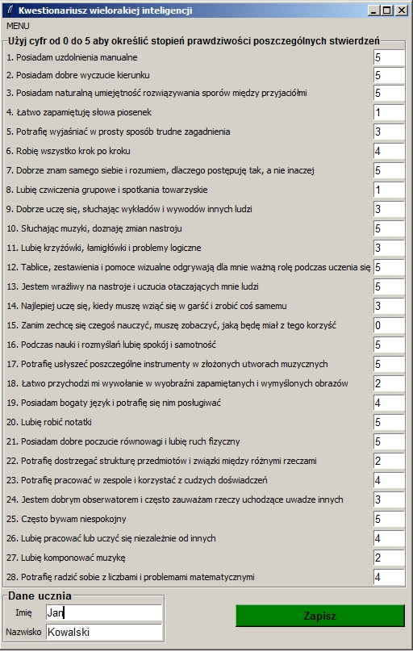
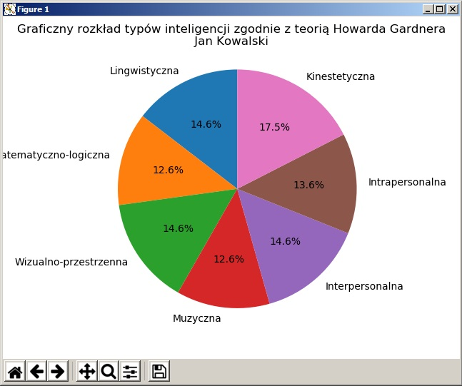

## Kwestionariusz_inteligencji_wielorakich_Howard_Gardner
Test określający kierunek zdolności umysłowych dziecka wg. Howarda Gardnera. 
Po uzupełnieniu wszystkich odpowiedzi przez użytkownika przedstawia wyniki w formie graficznej. 
Użytkownik może wprowadzić imię oraz nazwisko - które zostaną umieszczone w nagłówku wykresu. 
Program daje możliwość zapisania i późniejszego wydruku grafu. 

Zastosowane: 
- python
- matplotlib.pyplot
- tkinter

     
